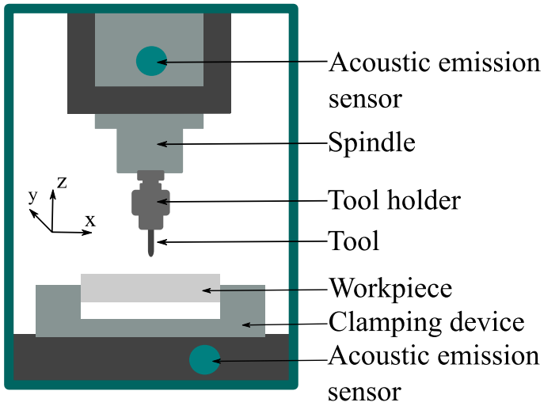

# AE of CNC cutting

This dataset consists of AE signals captured by AE sensors which were mounted into the OptiMill F80 CNC machine.
It is intended for studying and experimenting with data-based approaches for AE-based monitoring of the machine and process.

Reference: https://www.ndt.net/article/dgzfp2024/papers/419_manuscript.pdf

# Sensor placement

Two sensors were integrated manually into the machine. Hereby, one was placed close to the spindle, one other was placed on the movable table of the CNC machine.

Reference: https://www.ndt.net/article/ewgae2024/papers/1041_manuscript.pdf

## Process

- Material: 1.4305
- Dimensions: 280 x 150 x 30 mm

The material was cut along its width with various tools of differing conditions and under same process parameters.

## Measurement

- LinWave
- Settings:
  - Samplerate: 1 MHz
  - Input Range: 
    - Sensor 1: 5000 mV 
    - Sensor 2: 50 mV

## Files

All files can be requested here: quy.raven.luong@uni-a.de.

Each measurement consists of two binary files:

- The binary files consist of int16 values, which form an array that represents the raw structure-borne noise of the CNC cutting process
- Each binary belongs to one sensor
- In each measurement, eight to nine cutting processes were monitored.
  - Cutting process 1-3: Structure-borne noise of cutting steel, using tool of healthy condition
  - Cutting process 4-6: Structure-borne noise of cutting steel, using tool of worn-out condition
  - Cutting process 7-8|9: Structure-borne noise of cutting steel with holes (as simulated defects), using tool of healthy condition
